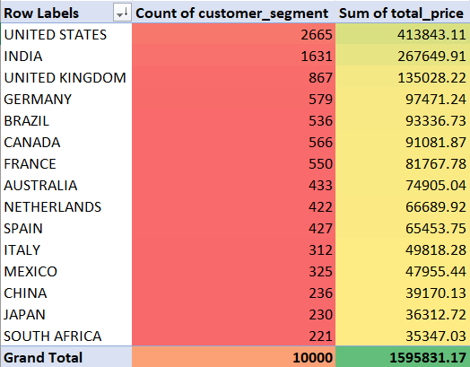
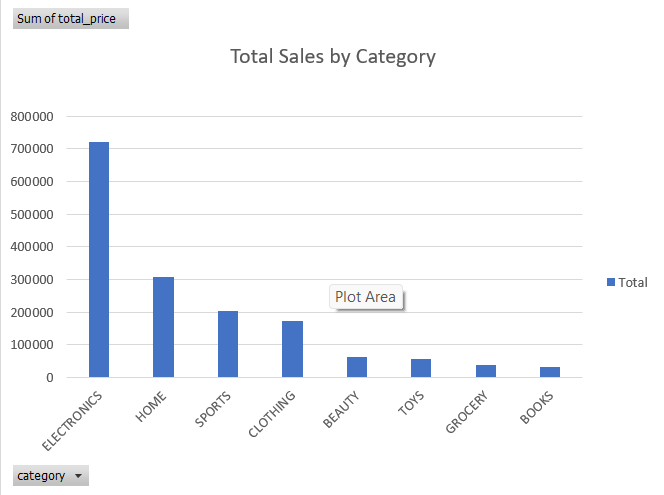

# Excel Pivot Analysis Project

## Objective
To analyze an e-commerce dataset using Excel pivot tables and dashboards.

## Pivot Analysis Overview

### Sales by Country and Customer Segment

### Total Sales by Category

## Key Insights
1. Electronics is the highest revenue-generating category.
2. United States leads in total sales.
3. High-Value customers contribute the most revenue.
4. Low-Value customers show high volume but low revenue.
5. Sales vary significantly by country.

## Files Included
- Pivot_Report.xlsx (interactive dashboard with slicers)
- Pivot_Report.pdf (static report)
- Insights.txt
